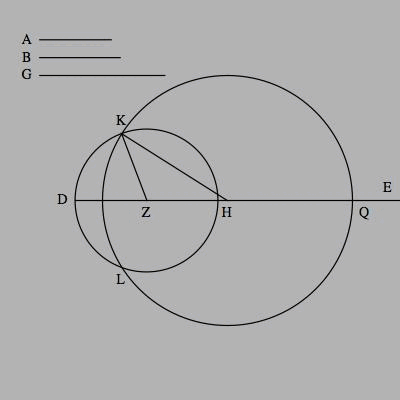
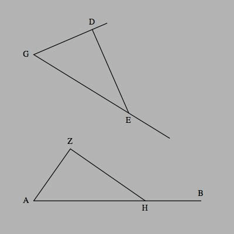
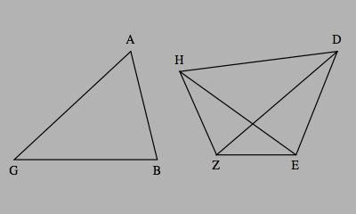
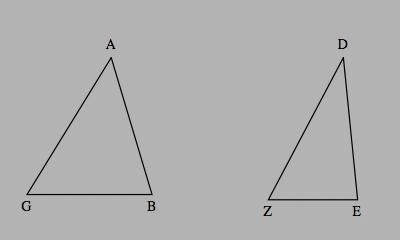

## _Papyrus Oxyrhynchus_ 82 5299 (_P.Oxy._ 82 5299): Euclid's Elements 1.4 (Diagram), 8–11, 14–25 (without Proofs)

### Date

3rd century CE

### Location 

Oxyrhynchus, Egypt

### Text

Column I: 

…[πλευ]ραις ισας̣ [εχη] ε̣κ̣ατε̣[ραν]…

…[ι]σ̣ων̣ ευθειω̣[ν] περιεχ[ομ]ε̣[νην]…

…τ̣εμειν̣…

…[δ]ι̣χα τεμ̣ειν̣…

…[δοθεντο]ς σημει̣ο̣[υ]…

…

…

…

…σ̣ημε[ιω]…

…[εφεξ]ης δυ[ο]…

…[ε]σοντα̣[ι]…

…

…

…

…ι̣σ̣…

…τ̣ι εαν δυο̣ ευθε̣[ιαι] τεμνω…

…[σιν α]λ̣λ̣η̣λ̣α̣ς τας κατα [κορυ]φην̣ γω…

…[νιας] η̣κεν̣η̣α̣ τ̣ων το̣ [τας] τ̣ε̣[σσ]αρας…

…[γωνι]α̣ς τεσ[σα]ρ̣σιν ο[ρθαις ισας] π̣οι…

…[ουσιν]…

…[παντος] τριγ̣ωνου η [εκτος γωνια εκ]α̣…

…τερας…

…

…[παντος] τριγω[νου αι] δυ̣[ο γωνιαι δυο ορ]…

…[θων ελ]ατ᾽το̣[νες] εισ̣[ι παντη μεταλαμ]…

…[πανομενε]…

…

Column II:

παντος τριγωνου υπο την μειζωνα πλευραν 

ραν η μειζων γω̣ν̣ι̣α̣ εστιν…

παντος τριγω[νου] υπο την̣ μ̣ειζωνα γω

νιαν η μειζω̣[ν] π̣λ̣ευρα υποθεινι 

[π]α̣ν̣τος τριγων[ου αι] δ̣υο πλε̣υ̣πραι της λυπης μει 

[ζονες εισι παντη] με̣ταλαμπανομενε 

[εαν τριγωνου επι] μ̣ι̣ας των πλ̣ευρων δυο ευθειαι 

[εντος συσταθω]σ[ιν] α̣ι συσταθεισαι̣ ε̣λατ᾽τονες μεν ε̣σον

[ται του τριγ]ων̣ο̣υ δυο πλ̣ε̣[υ]ρ̣[ω]ν̣ μειζονα δε την 

[γωνιαν περιξ]ο̣υσ̣ι̣…

[εκ τριων ευθ]ειων αι εισιν ισ̣α̣ι ταις δοθεισαις ευ

[θειαις] τ̣ρ̣ιγωνον συστησασθαι δι δη τας δυο της λυ

[της]  μειζονας ειναι παντη μεταλαμπαομενας

[προ]ς̣ τη δοθειση ευθεια και τω προς αυτην ση

[μει]ω̣ τη δοθειση γωνια ευθυγραμμω ισην 

[γων]ι̣α̣ν ευθυγραμμον συστησασθαι 

[εαν δ]υο τριγωνα τας δυο πλευρας ταις δυσι πλευ

[ραις ισα]ς εχν εκατεραν εκατερα και την γωνιαν 

[της γ]ωνιας μειζονα εχν την υπο των ισων 

[ευθει]ων περιεχομενην και την υπο των ισων 

[ως μ]ειζονα εξει // εαν δυο τρι̣γ̣ω̣να τας δυ-

[ο πλε]υρας ταις δυσι πλευραις ισας εχη εκατε

[ραν] ε̣κατερα και την βασιν της βασεως μειζονα 

[ε]χη̣ και την γωνιαν της γωνιας μειζονα εξι

την υπο των ισων ευθειων πειεχομενην 

### Translation

### Notes

13.8 x 16.9 cm

Column I: Book I Propositions 8–11, Column II: Book I Propositions 14–25

### Diagrams

_Column II; last four diagrams_

I.22

I.23

I.24

I.25

[Image Source](https://web.calstatela.edu/faculty/hmendel/Ancient%20Mathematics/Euclid/Euclid%20I/Euclid.1.Intro.html)

[Read More](https://figshare.com/articles/online_resource/P_Oxy_LXXXII_5299_Euclid_Elements_1_4_Diagram_8_11_14_25_without_Proofs_/21186181/2)

[Back](../resources.html)
